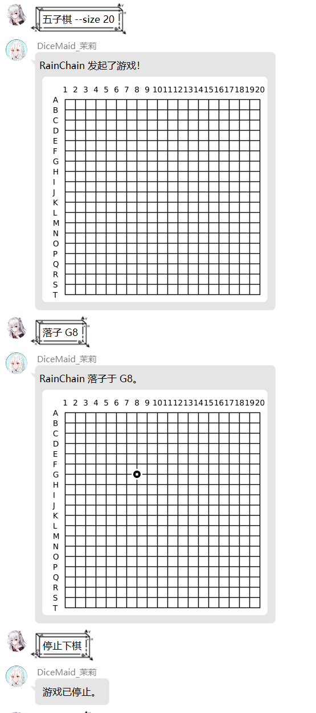

---
category:
  - 使用指南
  - Koishi
tag:
  - 游戏
---

# 棋类游戏

> _(你就这么静静看着棋盘对面全神贯注的少女，如此认真的模样可不多见。)_

这大概是怕群友无聊所以提供了一种在群里下棋的功能吧(

目前支持的有：

- 五子棋
- 围棋（禁全同，暂时不支持点目）
- 黑白棋

使用 chess 指令开始一个棋局：

```
/chess --rule <rule> [--size <size>]
```

> 以上指令，通过 rule 参数指定规则，通过 size 参数指定棋盘大小为多少（n\*n）。

或者直接使用已经注册号的快捷调用：**“围棋”，“五子棋”，“黑白棋”**，也可以开始一个棋局。（没有前缀）

比如你可以使用`五子棋 --size 20`开始一场棋盘大小为 20 的五子棋。

其中目前支持的棋局规则以及它们对应的规则名和默认棋盘大小为：

|     快捷名      | 规则名  | 默认大小 |
| :-------------: | :-----: | :------: |
|      围棋       |   go    |    19    |
|     五子棋      | gomoku  |    15    |
| 黑白棋 / 奥赛罗 | othello |    8     |

使用 `/chess --stop` 或者 `停止下棋` 可以停止一个正在进行的棋局。

你可以使用指令`落子 [位置]`用来放置棋子，如`落子 A3`

当棋局开始时，默认发起人是后手，而第一个响应这个棋局者是先手，当一位玩家使用`落子`后加入棋局，这时棋局有效，其他人无法加入。

可以使用`悔棋`让棋盘向后退一步。

使用`跳过回合`可以跳过一个回合。

输入`查看棋盘`可以查看当前正在进行的棋盘。


