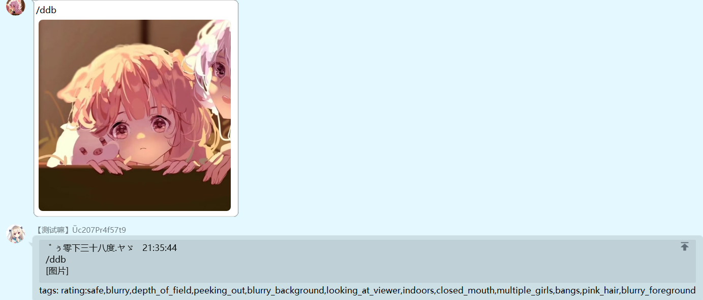

---
category:
  - 使用指南
  - Koishi
tag:
  - 制图
---

# DeepDanbooru 图片词条

> _阅图无数的她已经锻炼出了精炼概括图片的能力_

茉莉能够对输入的图片给予词条概括的输出，是对[NovelAi 作图](../koishi/novelai.md)的辅助功能，所以，同样此功能暂时仅在用户群开放。

基于深度学习卷积神经网络。

### "/ddb [图片]"

为了方便部分用户，这个指令也可以是交互式的，先输入`/ddb`看到提示后再输入图片。

> ddb 是 DeepDanbooru 的缩写。

