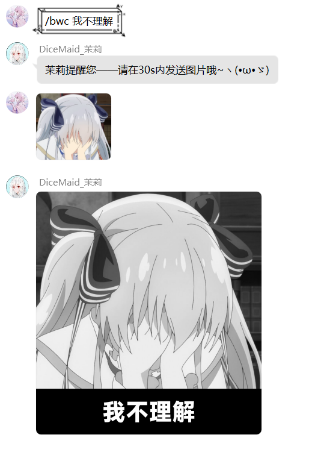

---
category:
  - 使用指南
  - Mirai
  - NoneBot2
tag:
  - 制图
---

# 奇怪的图片增加了

> 你听说茉莉最近学坏了，时不时会一个人偷着乐，于是你决定突击检查——奇怪的知识增加了。

茉莉在某些方面的天赋有时候令你感到惊讶，你永远不用担心和她在一起会感到无聊。

~~新的天赋:制图师已经解锁~~：茉莉现在拥有了制作 奇 怪 表情包的能力。

如果在使用过程中遇到问题，请**仔细阅读**本篇相关内容。

制图功能分为两部分实现，一部分为mirai部分（以下称PART 1），一部分为nonebot2部分（以下称PART 2）

## PART 1

:::warning 使用限制
PART 1的指令暂时**只能在群聊中**使用，且个人**好感度≥500**
:::

### "/ph [文字内容]"

生成Pxxnhub样式的文字，如果文字内容不加空格会自动在中间位置截断，若加空格，以空格为分割截断。

> 你说Pxxnhub是什么？抱歉，~~我不知道呢~~（逃

### "/bwc [文字内容]"

输入指令后，请**在30s内发送图片**。

> 方便记忆期间，解释一下bwc的含义——black white chinese：黑白中文。

将图片变为黑白并增加中文说明，直接上图吧！

### "/bwj [文字内容] [图片]"

是上面/bwc指令的变种，将图片加上黑白并增加中日双语说明。

> 类似的，bwj的含义为black white japanese：黑白日文

:::warning 注意
这条指令很特殊，需要**将图片放在指令中发送**，而不是分开发送。
:::

### "/5000兆 [文字内容]"

生成5000兆样式文字，同Pxxnhub样式，不加空格会自动在中间位置截断，若加空格，以空格为分割截断。

### "/[数字]%"

在图片上增加百分之多少的加载图，指令可以为/0% /10%...数字是随意的。

输入指令后，请**在30s内发送图片**。

### emoji合成

发送任意**两个emoji表情**，将会返回两个表情的合成图。

注意，必须是emoji表情哦！

~~不行了，容我笑会×~~

## PART 2

:::warning 使用限制
PART 2的指令私聊群聊均可使用，但要求好感度≥500
:::

这部分功能修改自[原项目](https://github.com/noneplugin/nonebot-plugin-memes)和[可爱的真寻bot！](https://github.com/HibiKier/zhenxun_bot)

因为..这部分内容实在有点多，我决定举几个例子把原项目的图给丢过来×

### "/鲁迅说 [文字内容]"

让你的话拥有鲁迅的加持，鲁迅注视着你！

### "/喜报 [文字内容]"

让奇怪的事也变得充满快乐×

### 剩余的类似指令

那么，下面剩下的指令就直接甩大图吧！

:::tip 提示
使用时，请在图片文字说明前**加上/**，如“王境泽”代表使用指令为“/王境泽”。
:::

:::tip 提示
图中需要多段文字的指令是**以空格隔开的**，如果一段文字中有空格，需要对那段文字上**加上英文双引号**，注意，是英文双引号。

如果有特殊符号，需要进行**转义**。
:::

那就...举个例子吧！

如！ "/王境泽 我就是饿死 "死外边 从这里跳下去" 也不会叫灵音一声主人的！ 真香"

来拆分一下吧，“/王境泽”指令需要四段，四部分分别是

+ 我就是饿死

+ 死外边 从这里跳下去

+ 也不会叫灵音一声主人的！

+ 真香

你可以注意到**第二部分中间有空格**，所以指令里用了**英文双引号包裹**。

效果图如下——

> 居然还有点羞耻×...

那么，其他指令同理，可以自行创造快乐(溜