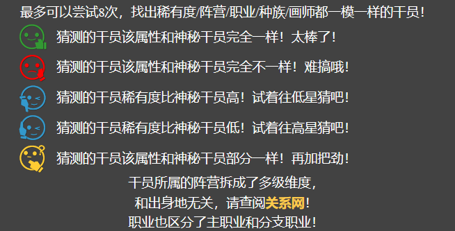

---
category:
  - 使用指南
  - NoneBot2
tag:
  - 游戏
---

# 这只干员有点神秘

> "猜——猜——我——是——谁？——"眼前的她不知从哪拿出了一套稀奇古怪的衣服，正模仿着谁。
>
> 你感觉她有点滑稽，当然你没有说出口。

该功能正式的名字叫做『干员猜猜乐』,应某人要求，将此功能从[原网站](http://akg.saki.cc)移了过来(

规则很简单，你需要在限定次数内，根据所给提示猜出正确的干员名称。

对了，忘了告诉你了，茉莉**喜欢和大家一起玩**这种游戏，所以请在群聊中和大家一起玩。

:::warning 博士认证
*请出示刀客塔识别码以继续前进。*
:::

提示和原站相同，如下——

那么，游戏现在开始——

### "/猜干员 [干员名]"

通过这个指令来开始游戏，和米娜桑合作一起找出这个神秘的干员是谁吧。

> 例:"/猜干员 艾雅法拉"
>
> 面对实在记不清干员名字的屑刀客塔，茉莉会**自动帮你补全**的，当然有**错字是打咩**的。
>
> 如："法拉"会补全成"艾雅法拉"

:::danger 答应我
在同一个群开始**新**的一轮游戏，茉莉首先需要花点时间准备扮演服装，请给她换装和调整情绪的时间。

(当然了，在猜测过程中，为了让你能更好把握信息，茉莉也需要一定时间来思考如何给出提示，**不要催她**，~~小心她哭给你看！~~)

若短时间内不进行游戏，请**让茉莉去休息**哦——(参见下文)
:::

### "/看答案"

茉莉精彩绝伦的演技让你们焦头烂额，绝望的你准备偷看剧本，被茉莉抓个正着。

> 例:"/看答案":终止当前猜谜，直接公布答案，可直接通过"/猜干员 [干员名]"开启下一轮

### "/不猜了"

屡战屡败的你无法承受这种屈辱，你决定逃之夭夭。

> 例:"/不猜了":终止当前群猜干员进程，重新输入"/猜干员 [干员名]"需要重新初始化。

因为**茉莉一直保持扮演是很累的**，所以请及时关闭进程。

当然，茉莉不傻，如果你坏心眼不让她去休息，她自己也会睡大觉的。