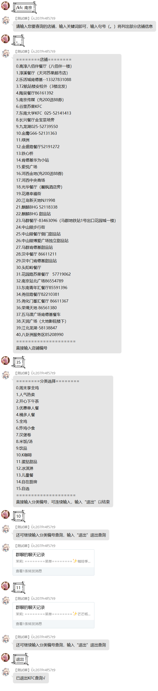

---
category:
  - 使用指南
  - NoneBot2
tag:
  - KFC
---

# KFC 查询

> _时刻掌握美食信息是吃货的自我修养 ☆~ 至少她是这么说的。_

这里提供了一种在聊天环境下查询 KFC 店铺食品的解决方案。

在星期四，支持的店铺会追加疯狂星期四的分类。

:::warning
此功能要求好感度 ≥500
:::

### "/kfc [地点]"

根据地点查找当地店铺，“城市名”或“城市名+**空格**+地区（县）名”。

接着，将会进入交互式操作阶段，茉莉将依次询问您：

- 店铺名是什么呢？

- 要选择该店铺下的何种食物分类？（可连续操作）

在查询过程中，**直接输入**“退出”来退出查询，没有前缀。

