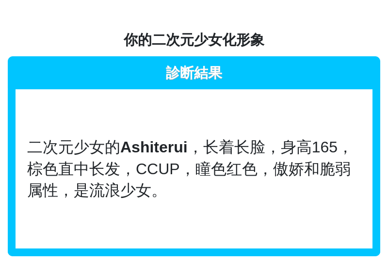

---
category:
  - 使用指南
  - NoneBot2
tag:
  - 占卜
---

# ShindanMaker占卜

> "茉莉茉莉告诉我..."你露出痴汉般的笑容向她步步紧逼，而茉莉早已用枕头蒙住头装作没听到。

这里是基于ShindanMaker网站的占卜，本质上完成这些占卜的都是原网站，茉莉只是发挥了她拍照的天赋。

初始拥有**多种可用占卜**，难以一一列出，可以通过以下指令查看当前所有占卜。

:::warning 好感限制
此功能要求好感度≥500
:::

### "/占卜列表"

列出当前**所有可用**占卜。

> 例:"/占卜列表"

各占卜指令大同小异，所以**举一个例子**应该就足够了吧~

### "/二次元少女 [名字]"

用你所填入的名字生成一个二次元少女的形象，~~谁没有梦想过自己成为一个二次元美少女呢？~~

如果不填入名字将自动使用群名片或昵称，但不是所有指令都有名字这一参数要求。

> 例:"/二次元少女 Ashiterui":为Ashiterui生成一个二次元少女形象。

:::info 还不满足？
如果你在原网站发现了有趣的占卜，欢迎通过".send"指令将**占卜的id**发送给我们，我们将会添加进列表~
:::

:::warning 提醒
本功能受网络环境影响，有可能出现卡顿、Error等情况。

如果很疑惑为什么几次结果都一样，那是因为你使用了同一个名字，一段时间内不会重复生成。
:::

#### 特别感谢
[nonebot_plugin_shindan](https://github.com/noneplugin/nonebot-plugin-shindan)